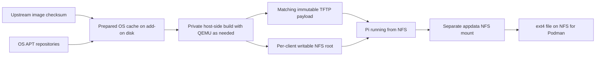

# Home Assistant Raspberry Pi PXE Fleet

A Home Assistant add-on for Raspberry Pi network boot: 32-bit Pi 1/2 and
64-bit Pi 3/4/5. An optional [SD retry loader](boot-media/README.md) supports
Pi 1, 2, 3B, 3B+ and 4 when the server may start later than the clients. Its firmware
and loader update through A/B slots only when their contents change. The add-on serves
versioned Raspberry Pi OS Lite roots over NFSv4 and boot files over TFTP, and runs
applications from signed APT repositories, OCI images using Podman, or both.

The operating system is disposable and stored on a **writable NFS root** unique
to each Pi and OS generation. Application data is a separate NFS mount. There is
no RAM-backed OS overlay. System files, APT databases and client package updates
persist on the server across ordinary reboots.

The add-on installs OS updates and initial APT applications on its own local disk,
using QEMU when necessary. It publishes a new root and reboots the Pi after the
build succeeds; it never runs host-side APT against a root being used by a client.
Podman uses an ext4 disk-image file stored on the Pi's NFS appdata share, mounted
at `/var/lib/containers`. Images and writable layers survive reboots and OS
replacement. No local client disk or additional network protocol is required.
Only normal runtime files, bounded logs, and reclaimable disk caches use RAM.

Every day by default, the add-on checks the official Lite image checksum and APT
repositories for each configured architecture. A fresh image download/extraction
and base build happens only on first use or a changed upstream SHA256. The verified
hash and updated base are retained. With an unchanged hash, APT checks the prepared
base; only package or builder changes cause a private update and boot-file rebuild.
An unchanged result creates no generation and requests no reboot.

This uses checksum gating rather than guessing major versions from image filenames.
A same-release image refresh with a new hash can therefore trigger a clean build;
new major Raspberry Pi OS releases also do. APT applications and mutable container
tags update hourly on clients, writing to disk-backed NFS storage.

**Experimental:** the automated checks exercise Linux image construction and
network filesystems. Physical Pi boot and Home Assistant OS integration still
need hardware validation. There is no migration layer for the previous Docker
fleet add-on.

## Install

1. Add this repository to Home Assistant's add-on/app store repositories and
   install **Raspberry Pi PXE Fleet** on an ARM64 or x86-64 host.
2. Disable Protection mode. NFS, loop mounts and offline builds need elevated
   access. The add-on registers QEMU binfmt interpreters when cross-building
   client OS images.
3. Copy [examples/fleet.yaml](examples/fleet.yaml) into the add-on's public
   configuration directory as `fleet.yaml`. Set real server/client addresses,
   your LAN DNS server and each Pi's serial number. Leave the add-on's
   `config_file` option set to `fleet.yaml`.
4. Choose native Ethernet boot or prepare the optional
   [SD retry card](boot-media/README.md). Configure DHCP reservations for each Pi.
   For native boot, point your DHCP/ProxyDHCP service at the Home Assistant host
   for TFTP and enable network boot in the Pi's bootloader. SD boot only needs the
   reservation and the server address embedded in its card. DHCP is provided by
   your network, not this add-on.
5. Start the add-on, wait for a boot target to be published in its log, then boot
   the Pis. Restart the add-on after editing `fleet.yaml`.

See [the add-on guide](pxe_fleet/DOCS.md) for configuration, persistence, updates,
rollback and operational limits. See [CONTRIBUTING.md](CONTRIBUTING.md) for tests
and the opt-in real-image and NFS/TFTP integration checks.
