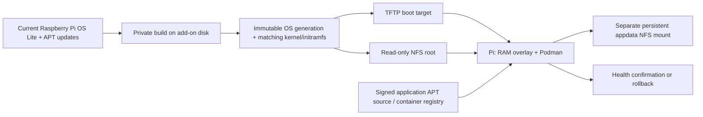

# Home Assistant Raspberry Pi PXE Fleet

A Home Assistant add-on for Raspberry Pi network boot: 32-bit Pi 1/2 and
64-bit Pi 3/4/5. An optional [SD retry loader](boot-media/README.md) supports
Pi 1, 2, 3B, 3B+ and 4 when the server may start later than the clients. Its firmware
and loader update through A/B slots only when their contents change. The add-on serves
versioned Raspberry Pi OS Lite roots over NFSv4 and boot files over TFTP, and runs
applications from signed APT repositories, OCI images using Podman, or both.

The operating system is disposable. Application data is a separate NFS mount.
The add-on preinstalls APT applications in each new OS generation. Subsequent APT
updates, routine OS writes, logs and Podman image storage happen in RAM on the Pi.
The add-on builds replacement operating systems on its local disk;
it never runs APT against a root being used by a client.

Every day by default, the add-on discovers the current official Lite image for
each configured architecture, verifies its SHA256, runs an offline OS update and builds matching boot files.
A changed image, package set or configuration creates a fresh generation.
This includes future major Debian-based Raspberry Pi OS releases: the new image
is rebuilt from scratch. Clients automatically reboot into the new generation.
APT applications and mutable container tags update hourly by default.

**Experimental:** the automated checks exercise Linux image construction and
network filesystems. Physical Pi boot and Home Assistant OS integration still
need hardware validation. There is no migration layer for the previous Docker
fleet add-on.

## Install

1. Add this repository to Home Assistant's add-on/app store repositories and
   install **Raspberry Pi PXE Fleet** on an ARM64 or x86-64 host.
2. Disable Protection mode. NFS, loop mounts and offline builds need elevated
   access. The add-on registers QEMU binfmt interpreters when cross-building
   client OS images.
3. Copy [examples/fleet.yaml](examples/fleet.yaml) into the add-on's public
   configuration directory as `fleet.yaml`. Set real server/client addresses,
   your LAN DNS server and each Pi's serial number. Leave the add-on's
   `config_file` option set to `fleet.yaml`.
4. Choose native Ethernet boot or prepare the optional
   [SD retry card](boot-media/README.md). Configure DHCP reservations for each Pi.
   For native boot, point your DHCP/ProxyDHCP service at the Home Assistant host
   for TFTP and enable network boot in the Pi's bootloader. SD boot only needs the
   reservation and the server address embedded in its card. DHCP is provided by
   your network, not this add-on.
5. Start the add-on, wait for a boot target to be published in its log, then boot
   the Pis. Restart the add-on after editing `fleet.yaml`.

See [the add-on guide](pxe_fleet/DOCS.md) for configuration, persistence, updates,
rollback and operational limits. See [CONTRIBUTING.md](CONTRIBUTING.md) for tests
and the opt-in real-image and NFS/TFTP integration checks.
